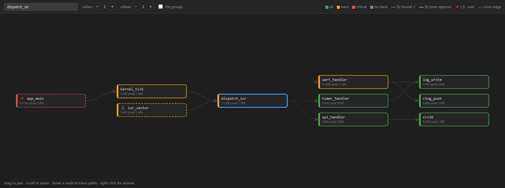
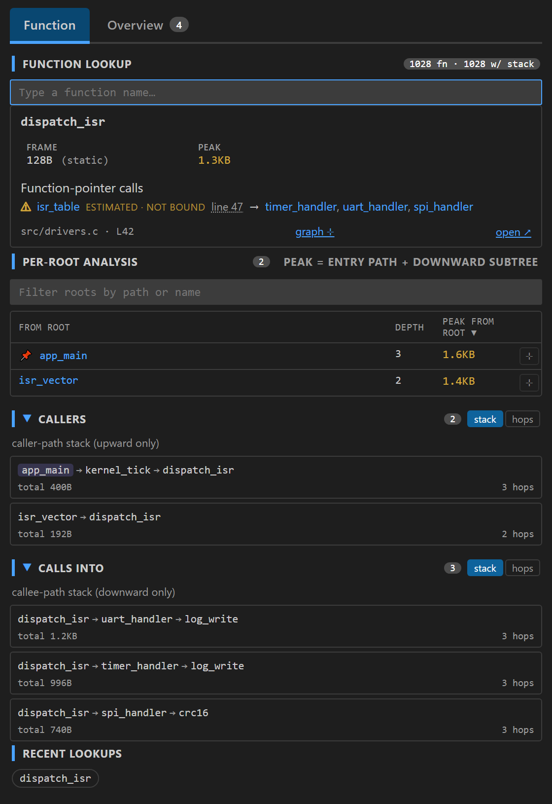
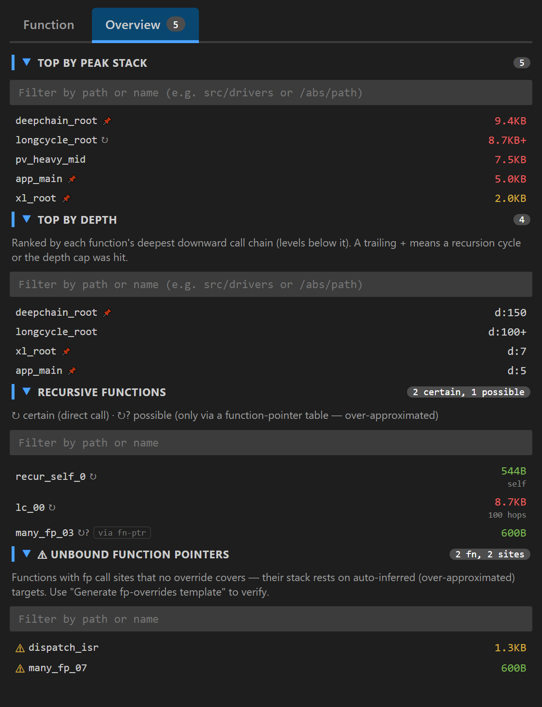
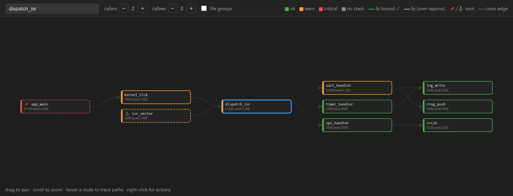
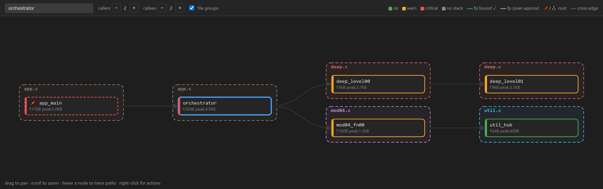
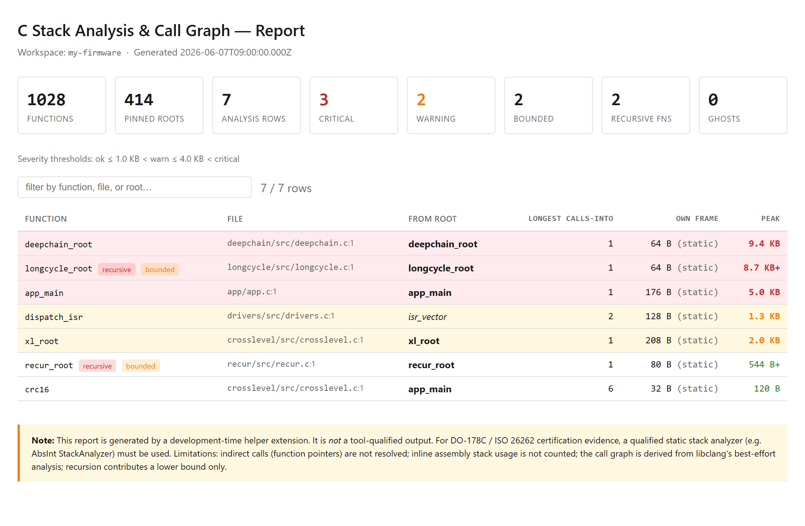

# C Stack Analysis & Call Graph

A VS Code extension that annotates C functions with **call depth** and
**worst-case stack usage**, designed as a development-time aid for static
stack analysis (e.g. when working toward DO-178C / ISO 26262 stack-usage
evidence).



Each function definition gets one inline pill at the end of its name line:

```
static int compute(int x)  ‹ via task_main · f:48B · p:1.1KB › +2
```

- **f** (frame) — own stack frame in bytes, from `-fstack-usage`.
- **p** (peak) — worst-case cumulative stack from this function downward.
  A trailing `+` means a recursion cycle or the depth cap was hit, so the
  number is a lower bound.
- **via ROOT** — the entry point this peak is attributed to. The pill shows the
  single **worst (highest-peak) root**; if the function is reachable from more
  roots, a compact **`+N`** badge follows (here `+2`). The full per-root
  breakdown — and each root's call **depth** — lives in the hover and the side
  panel (depth is not shown inline).

Markers in the pill: `📌` pinned root · `⚓` auto root (no callers) · `↻`
recursion · `≀✓` all function-pointer call sites manually bound (exact) ·
`≀~` has a function-pointer call that is **not** bound (worst-case estimate) ·
`≀` indirect call(s) present. (The certain-vs-possible recursion distinction —
`↻` vs `↻?` — is shown in the hover and side panel; see below.)

### Certain vs. possible recursion

The side panel has a **Recursive functions** section that separates two cases:

- **Certain (`↻`)** — a *direct* call edge participates in the cycle. This is
  real recursion.
- **Possible (`↻?`)** — the cycle exists only through function-pointer edges,
  which the analyzer over-approximates (an indirect call is assumed to reach
  *any* function the referenced table was initialized with). Such a cycle is a
  safe worst-case for stack bounding but may not be real recursion — e.g. if a
  function only ever calls `table[1]` but the table also contains the function
  itself, an over-approximated self-edge appears. Treat `↻?` as "review this",
  not "this definitely recurses".

## Requirements

- **Python 3** and the **`libclang`** package (`pip install libclang`, which
  ships its own native library — no separate LLVM/clangd install needed).
- **`compile_commands.json`** in your project (CMake:
  `-DCMAKE_EXPORT_COMPILE_COMMANDS=ON`; Make: `bear -- make`). The analyzer
  reads it to know which files to analyze and how to parse them.
- For stack numbers, build with **`-fstack-usage`** (produces `.su` files) and
  point `cCallDepth.suDirectory` at the build dir.

## How the call graph is built

The analyzer parses every translation unit listed in `compile_commands.json`
with **libclang** and extracts the call graph **directly from the AST**:

- Every function definition is found (including **static** functions), keyed by
  libclang's USR so the same extern function merges across files while
  same-named statics stay distinct.
- Each call expression in a function body resolves to its callee.
- **Function-pointer tables** are resolved automatically: the initializer of a
  table like `static fn_t vt[] = { a, b, c };` is read, and an indirect call
  through it is treated as potentially reaching any of those targets
  (worst-case over-approximation — the right default for stack analysis).

There is no clangd, no language server, and no GCC `.expand` dependency. Stack
frames come from `.su` files (`-fstack-usage`) and are matched to functions by
name, file-qualified so same-named statics get their own frame.

### Manual function-pointer verification (overrides)

The automatic over-approximation is safe but can be too broad — an indirect call
through a table is assumed to reach *every* entry, even when you know only some
are reachable in this build. You can pin the exact targets of a specific call
site with a JSON file (default `<workspace>/fp-overrides.json`, or set
`cCallDepth.fpOverridesPath`):

```jsonc
{
  "overrides": [
    {
      "caller": "dispatch_isr",     // function containing the indirect call (required)
      "via": "vector_table",         // fp variable/table invoked — stable matcher
      "file": "drivers/src/drivers.c", // optional; matched by basename
      "targets": ["isr_timer", "isr_uart"], // the verified target list
      "note": "only timer+uart wired in this configuration"
    }
  ]
}
```

A call site is identified by `caller` (required) plus `via` (the name of the
function-pointer variable/table being invoked). This pair is **stable across
source edits** — inserting code above the call site won't break the override,
because no line numbers are involved. The generated template uses exactly this
key (no `line` field). If a caller has only one fp call site, `caller` alone is
enough. Every discriminator you specify must match; the most specific matching
override wins. `file` (basename) is also matched when given. (A `line` field is
still accepted if you add one by hand, but it isn't generated or needed.)

The listed `targets` **replace** the auto-resolved candidates for that call site
(so you can both narrow the list and add targets the analyzer missed), and the
site is marked **verified** — its fp edges are then treated as exact, so a cycle
that runs through them is reported as certain (`↻`) rather than possible (`↻?`).
Editing this file re-runs analysis without re-parsing unchanged sources.

An override with **no `targets` and no `conditional` targets binds nothing**, so
it is ignored (with a warning in the output log) and the call site is left
**auto-estimated (not bound)** — it keeps the worst-case over-approximation and
still shows up under "Unbound function pointers". To actually bind a site you
must list at least one target (unconditional or conditional).

### Parameter callbacks

When a function pointer arrives as a **parameter** (e.g. `apply(cb, x)` calling
`cb(x)`), it can't be resolved from within the function. The
**Generate fp-overrides template** command analyzes the call hierarchy: it looks
at every caller of the enclosing function and collects the functions they pass
at that argument position, then pre-fills `targets` with those as a SUGGESTION
(the entry's `_hint` says so). This is template-only — it does not change edges
or peak — so you review the suggestion and bind it explicitly if correct.

The suggester handles several harder shapes:
- **Multi-level callbacks** — a callback forwarded through several parameter
  layers (`top(cb)` → `mid(cb)` → `bottom(cb)` → `cb()`) is traced back through
  the forwarding chain to the concrete function supplied at the head.
- **Multiple fp parameters** — each parameter position is resolved
  independently, so `apply2(a, b, x)` suggests the right target for `a` and `b`
  separately.
- **Struct-field assignment** — `dev.on_event = handler; … dev.on_event(x)`
  surfaces `handler` as a candidate, keyed by the field name. Runtime
  assignments are handled too: a field set conditionally or reassigned within a
  function yields exactly those branch targets; a field assigned in one function
  and invoked in another (e.g. a global struct configured by a `setup()`) falls
  back to the safe union of all assignments to that field (never missing one).
- **Array-of-struct fp fields** — `tbl[i].fn(x)` surfaces the table's targets.

In the side panel's **Function-pointer calls** section, each site's **line N** is
clickable (jumps straight to the indirect call in source), and each inferred
target is a clickable function link (opens it in the panel, with hover info and a
right-click menu) — so you can follow an fp edge without hunting for it.

#### Conditional targets

A call site can also resolve to different targets depending on the call context,
via a `conditional` list. Each entry has a `when` condition and the `targets`
that apply when it holds. Conditions are `fromRoot` (the traversal's entry
function), `callerContains` (a function present on the current call chain), and
`all` / `any` / `not` combinators:

```jsonc
{
  "overrides": [
    {
      "caller": "dispatch", "file": "m.c", "via": "handler",
      "conditional": [
        { "when": { "fromRoot": "task_a" }, "targets": ["handler_a"] },
        { "when": { "fromRoot": "task_b" }, "targets": ["handler_b"] },
        { "when": { "all": [ { "callerContains": "init" },
                             { "any": [ { "fromRoot": "task_c" },
                                        { "not": { "fromRoot": "task_d" } } ] } ] },
          "targets": ["handler_c"] }
      ]
    }
  ]
}
```

Conditional targets appear in the graph and recursion check as *possible* edges,
but the **per-root peak** follows a conditional edge only from roots/paths where
its condition holds — so `dispatch` reached from `task_a` includes only
`handler_a`'s stack, and from `task_b` only `handler_b`'s. The function's own
(root-independent) top-card peak still treats every conditional edge as active
(absolute worst case).

### Removing impossible edges

Sometimes the analyzer records a call that can't actually happen in your build —
an over-approximated function-pointer target, a call guarded out by a macro, or
a hand-written assumption you want to encode. You can prune specific
**caller → callee** edges with a JSON file (default `<workspace>/edge-removals.json`,
or set `cCallDepth.edgeRemovalsPath`):

```jsonc
{
  "removals": [
    { "caller": "dispatch", "callee": "handler_legacy",
      "file": "drivers/src/drivers.c",   // optional caller-file basename
      "note": "never wired in this product variant" }
  ]
}
```

Each entry removes that one edge **wherever it came from** — a direct call, an
fp/indirect target, or a conditional target — so the pruned edge disappears from
the call graph, peak, depth, and the Calls-into/Callers paths entirely. Matching
is by function **name**; a same-named static is matched by its bare name, and the
optional `file` (the caller's file basename) disambiguates two callers that share
a name. Only `callee` is required — **`caller` is optional**: omit it (or use
`"*"`) to remove the edge into `callee` from **any** caller. With a `caller`,
removal is scoped to it (other callers of the same callee keep their edge).
Editing the file re-runs analysis (unchanged sources are not re-parsed). This is
the complement of fp-overrides: overrides **narrow/verify** fp targets, removals
**delete** an edge outright.

#### Conditional removals

Add a `when` condition to remove an edge only when a guard holds:

```jsonc
{
  "removals": [
    // remove dispatch→handler_b only if task_a reaches dispatch
    { "caller": "dispatch", "callee": "handler_b", "when": { "fromRoot": "task_a" } },
    // remove dispatch→handler_c only if isr_ctx reaches dispatch
    { "caller": "dispatch", "callee": "handler_c", "when": { "callerContains": "isr_ctx" } },
    { "caller": "f", "callee": "g", "when": { "any": [ { "fromRoot": "a" }, { "fromRoot": "b" } ] } },
    // caller omitted = ANY caller of B: drop X→B for every X that A reaches
    { "callee": "B", "when": { "callerContains": "A" } }
  ]
}
```

Conditions: `callerContains C` / `fromRoot C` both mean **"C reaches the edge's
caller"** (C is a transitive caller), combined with `all` / `any` / `not`. The
condition is evaluated **statically against the call graph**, so a conditional
removal is **global, like an unconditional one** — the matching edge is pruned
from the single shared graph and therefore disappears from **every** view (the
call graph, own peak, downDepth, per-root Depth/Peak, and the Calls-into/Callers
paths). Omit `caller` (or use `"*"`) to apply the rule to every caller of
`callee`. Note: because the graph is a single static structure, removing an edge
removes it for **all** callers of that node — e.g. with a named caller `A→B`,
`A→B` is gone for every caller of `A`, not just on paths through the condition's
function.

## Side panel

The side panel is split into two tabs that separate the two ways you use it:

- **Function** — the search box and the per-function detail view (frame, peak,
  callers, calls-into, recursion paths, per-root analysis). Looking up or
  clicking any function opens it here, switching to this tab automatically.
- **Overview** — the always-on, workspace-wide lists: **Top by peak stack**,
  **Top by depth**, **Top by frame**, **Recursive functions**, and **Unbound
  function pointers**. The tab shows a badge with how many functions the analysis
  covers.



The **Top by …** lists rank every function by its own cost: **Top by peak stack**
by worst-case cumulative bytes, **Top by depth** by deepest downward call chain
(shown as `d:N`; a trailing `+` means a recursion cycle or the depth cap was
hit), and **Top by frame** by the function's *own* stack frame (its
`-fstack-usage` size, distinct from the cumulative peak below it). The last-used
tab is remembered, and clicking a function in any Overview list jumps straight to
its detail in the Function tab.



### Collapsible sections & incremental lists

The side panel's sections — **Top by peak stack**, **Top by depth**,
**Top by frame**, **Callers**, **Calls into**, **Recursion paths**, **Recursive
functions**, and **Unbound function pointers** — have collapsible headers (click the ▶ to
fold/unfold), and their open/closed state is remembered across lookups. Long
lists show a first batch and offer **show N more / show all / show less**, so a
function with hundreds of callers stays readable.

The **Callers** and **Calls into** sections also carry a **stack / hops** sort
toggle in their headers: order the chains by deepest cumulative stack (`stack`,
the default) or by longest call chain in hops (`hops`). Each section remembers
its choice across functions.

The **Top by peak stack**, **Top by depth**, **Top by frame**, **Recursive
functions**, and **Unbound function pointers** lists, and the **Per-root
analysis** table, each have a filter box: type part of an absolute file path (e.g. `src/drivers` or a
full `/path/to/file.c`) — or a function name — to narrow the list to that
location, with the matched path fragment highlighted. Clearing the box (or
pressing Escape) restores the full view. The overview lists start collapsed so
the tab opens compact; expand the ones you want, and that choice is remembered.

Switching to another sidebar view and back no longer loses your place: the open
function, the section collapse states, and the filters are retained, and the
detail view is restored automatically.

### Hover tooltips

Hovering a node in the call graph shows a tooltip with the function name plus a
short summary: **Frame**, **Peak**, and role bits (📌 pinned / ⚓ auto root,
recursive ↻, fp bound ✓ or fp estimated). The side panel shows the same
**Frame** / **Peak** / recursion summary on its function links; the full root
and fp role bits appear on the call-graph node hover.

### Per-root → call graph shortcut

In the side panel's **Per-root analysis** table, each (non-pseudo) root row has a
small ⊹ button. Clicking it opens the call graph focused on that **root**, with
callers hidden and callees expanded just deep enough to reach the function you
were inspecting — so you see the exact root→…→function path. The target function
is briefly pulsed/highlighted on arrival.

## Configuration & standalone use

The bundled analyzer (`cdepth_cli`) can run both inside the extension and as a
standalone command. Configure via VS Code settings:

```jsonc
{
  "cCallDepth.pythonPath": "python3",
  "cCallDepth.suDirectory": "build",
  "cCallDepth.rootPatterns": ["**/app/**"],
  "cCallDepth.libclangPath": "",
  "cCallDepth.clangArgs": []
}
```

Parse flags come entirely from `compile_commands.json` (per file) — the analyzer
does not probe the system compiler for default include paths. A correct
`compile_commands.json` already carries the include paths the build uses; if
yours is missing some (or you target a cross toolchain), add the needed
`-isystem`/`-I` flags via `clangArgs`.

- `libclangPath` overrides libclang auto-detection — give the
  `libclang.so/.dylib/.dll` file or its directory (rarely needed).
- `clangArgs` adds extra parse flags on top of `compile_commands.json`.
- Warning flags from `compile_commands.json` (`-Wall`, `-Werror`, `-Wno-...`)
  are dropped automatically — they're irrelevant to the call graph and some are
  GCC-specific.

The same analyzer runs standalone from a terminal (useful for CI):

```bash
pip install libclang
python -m cdepth_cli --root ./src --su-dir ./build \
    --root-pattern '**/app/**' --report stack.html --out result.json
```

It analyzes exactly the translation units in `compile_commands.json` (set
`cCallDepth.compileCommandsDir` / `--compile-commands-dir` if it isn't at the
workspace root or a `build` subdir). If no `compile_commands.json` is found, or
it lists no usable files, it stops with an error rather than guessing.

**Version matching.** If you point `libclangPath` at your own
`libclang.so/.dll`, its version should match the `clang.cindex` Python bindings
(the `libclang` pip package). A mismatch makes the native library return AST
node kinds the bindings don't know, surfacing as `Unknown ... kind N` (e.g.
`unknown template argument kind 350`). The analyzer is defensive — it skips
nodes it can't decode and keeps going — but for complete results, either let it
use the bundled library (leave `libclangPath` empty) or install a matching
`libclang` package version: `pip install "libclang==<your-llvm-major>.*"`.

## Pinned roots & per-root analysis

By default any function with no caller is a root (depth 1). For real codebases
you usually want to declare your architectural entry points explicitly — task
bodies, ISRs, public API. Use `rootPatterns` (globs over header paths):

```jsonc
{
  "cCallDepth.rootPatterns": ["**/components/*/public/**", "**/apps/public/**"]
}
```

Every function declared in a matching header becomes a **pinned root**: it gets
depth 1 *and* remains a starting point for analysis even if other code calls
it. A function reachable from several pinned roots is analyzed once per root;
the inline pill shows the worst (highest-peak) root with a `+N` badge for the
rest, while the hover and side panel list every root with its own depth. This
matters for stack analysis: each entry point is an independent worst-case origin.

## Interactive call graph

**`C Call Depth: Open call graph`** opens a full-panel, interactive
node-link view of the call hierarchy. It shows a bounded neighborhood around
a *focus* function: callers fan out to the left, callees to the right, with
the focus in the center.



- **Layered layout** — caller layers on the left (−1, −2…), focus in the
  middle, callee layers on the right (+1, +2…). Heavy nodes sort to the top
  of each layer.
- **Severity coloring** — node border/bar colored by peak stack
  (green/orange/red), gray when no stack data. Recursion marked `↻`,
  indirect (function-pointer) edges drawn dashed.
- **Navigate** — right-click a node for actions: *Open source*, *Show details in
  side panel*, and *Focus in call graph*. The menu header/footer show the
  function name, own frame, and peak. A left-click just highlights the node's
  call paths and flashes the bottom hint toward the right-click actions — it
  doesn't refocus. A search box (top-left) jumps to any function.
- **Trace paths** — hover a node to light only the focus's call flow that passes
  through it: the corridor from the focus to that node, plus the node's own
  continuation (its further callees if it's downstream, or its further callers
  if it's upstream). Everything else — including the node's own callers/callees
  that don't route through the focus — dims out. Hover the focus itself to light
  its whole flow. Back-edges and same-level sibling edges always stay dim, so
  the flow reads cleanly.
- **File groups** — toggle "file groups" to wrap same-file nodes in labeled
  frames (one per file per column). Node colors stay severity-based; the
  frames are colored per file.
- **Depth controls** — the "callers" and "callees" steppers expand or contract
  how many hops each side shows (2 each by default; no fixed upper bound — very
  large neighborhoods are capped by a node budget that marks the truncation).
  Nodes with hidden callers/callees are marked `…`.
- **Pan & zoom** — left-drag to pan, scroll to zoom; the view auto-fits on
  each refocus.
- **Readable edges** — every call edge is drawn over a background-colored halo,
  so lines stay legible where they pass over a node box or cross other edges. A
  **self-call** (direct self-recursion) is drawn as a small arc on top of the
  node — clearly visible rather than a hidden line through the box.



You can open it focused on a specific function from: the editor right-click
menu (on a C symbol), the **⊹ view in call graph** link in the hover, or the
**graph ⊹** button in the side panel.

## Reports

**`C Call Depth: Export report (CSV / HTML)`** writes a report, sorted with
the most critical first. It first asks what to include:

- **Roots only** — one row per entry point (pinned or auto root), each with its
  full downward peak. This is the usual stack-budget view: the worst-case stack
  each entry point needs.
- **All functions** — one row per (function, root) pair, for detailed tracing.

…then the format:

- **HTML** — severity-colored, opens in a browser, includes a summary and a
  limitations disclaimer.
- **CSV** — for spreadsheets, diffing, and traceability.

The standalone CLI mirrors this with `--report` / `--csv` and a `--roots-only`
flag.



## Commands

| Command | What it does |
|---|---|
| `C Call Depth: Refresh analysis` | Re-run the full pipeline (incremental — unchanged files are cached). |
| `C Call Depth: Clear cache and refresh (full re-parse)` | Drop the per-TU cache and re-parse every file from scratch. |
| `C Call Depth: Focus side panel` | Open the lookup/explorer panel. |
| `C Call Depth: Open call graph` | Open the interactive call-graph view. |
| `C Call Depth: Generate fp-overrides template` | Write a starter `fp-overrides.json` of unresolved fp call sites. |
| `C Call Depth: Export report (CSV / HTML)` | Write a per-root report. |
| `C Call Depth: Show log` | Open the output log. |

## Settings

| Setting | Default | Meaning |
|---|---|---|
| `cCallDepth.suDirectory` | `""` | Directory scanned for `.su` files (stack frames). Empty disables stack-usage analysis. |
| `cCallDepth.compileCommandsDir` | `""` | Path to `compile_commands.json` or its directory. Supports `${...}` variables (see [Path variables](#path-variables)). Empty = workspace root, then `build/`. |
| `cCallDepth.rootPatterns` | `[]` | Header globs whose declared functions become pinned roots. |
| `cCallDepth.pythonPath` | `python3` | Python 3 interpreter that runs the analyzer. |
| `cCallDepth.libclangPath` | `""` | libclang `.so/.dylib/.dll` file or its directory. Empty = auto-detect. |
| `cCallDepth.clangArgs` | `[]` | Extra parse flags appended to those from `compile_commands.json`. |
| `cCallDepth.displayMode` | `decoration` | `decoration` (pills) or `hover`. |
| `cCallDepth.stackThresholds.warn` | `1024` | Peak ≤ this renders green; above renders orange (warn). |
| `cCallDepth.stackThresholds.critical` | `4096` | Peak above this renders red (critical). |
| `cCallDepth.maxDepthForCumulative` | `256` | Safety cap for cumulative-stack and per-root **Depth** traversal under unbroken recursion. Raise if your chains are deeper. |
| `cCallDepth.pathsLimit` | `5` | Paths shown per direction in hover/panel. |
| `cCallDepth.pathsMaxDepth` | `32` | Max path length explored. Raise for very deep chains. |
| `cCallDepth.fpOverridesPath` | `""` | JSON of call-site fp overrides (manual verification/narrowing). Empty = `<workspace>/fp-overrides.json` if present. |
| `cCallDepth.edgeRemovalsPath` | `""` | JSON of impossible call edges to prune (`{removals:[{caller,callee,file?}]}`). Empty = `<workspace>/edge-removals.json` if present. |
| `cCallDepth.logLevel` | `info` | `debug` \| `info` \| `warn` \| `error`. |

### Path variables

The path settings — `compileCommandsDir`, `suDirectory`, `fpOverridesPath`,
`edgeRemovalsPath`, `libclangPath`, `pythonPath`, and `clangArgs` — expand
VS Code-style `${...}` variables, so a path can reference the workspace, the
environment, your home directory, or **another setting**. For example, reuse a
build directory defined by the CMake Tools extension instead of duplicating it:

```jsonc
// .vscode/settings.json
"cCallDepth.compileCommandsDir": "${config:cmake.buildDirectory}/compile_commands.json"
```

Supported: `${workspaceFolder}`, `${workspaceFolder:Name}` (multi-root),
`${userHome}`, `${pathSeparator}` (`${/}`), `${env:NAME}`, and
`${config:section.key}` (any other setting's value). Unknown variables are left
untouched. Plain absolute paths and workspace-relative paths still work as before.

## How it works (pipeline)

1. **Parse** every translation unit in `compile_commands.json` with libclang;
   unchanged files are served from a per-TU cache (incremental).
2. **Call graph** extracted directly from the AST: function definitions (by
   USR, so statics stay distinct), direct call edges, and function-pointer
   table targets resolved automatically (over-approximated).
3. **`.su` matching**: stack frames matched to functions by name, file-
   qualified so same-named statics get their own frame.
4. **Pinned roots** applied from `rootPatterns` (matched on the declaration /
   header location).
5. **Depth + peak** computed per root; recursion is flagged (certain vs.
   possible-via-fp) and contributes a bounded lower bound.

## DO-178C / qualification note

This extension is **not a qualified tool**. The call graph is best-effort
(libclang AST), function-pointer targets are over-approximated, inline
assembly stack usage is not counted, and recursion contributes a lower bound.
Use it as a fast review aid during development. For Level A/B certification
evidence, use a qualified static stack analyzer (e.g. AbsInt StackAnalyzer),
and treat the `fp-overrides.json` file and exported reports as review artifacts —
they cross-check nicely against a qualified tool's output.

## Development note

This extension was developed with the assistance of AI (Anthropic's Claude).
All output should be reviewed before being relied upon — and, as noted above,
this is an engineering aid, **not** a tool-qualified analyzer.
